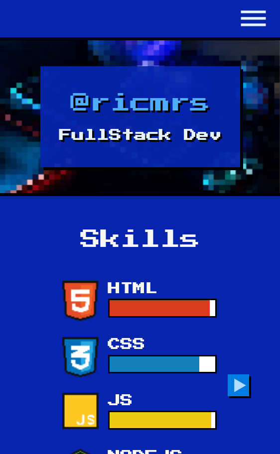

# FrontPage - @ricmrs

Esta é uma página de apresentação do meu perfil. O layout da página foi inspirado no curso de html e css ministrado pelo [@marcobrunodev ](https://github.com/marcobrunodev).
Baseado no curso em html, o site foi desenvolvido com o framework NextJS utilizando as boas práticas de programação. 

## Links

- [Live website](https://frontpage-lime.vercel.app/)
- [Figma Design](https://www.figma.com/community/file/1307107053854601336)

## Screenshot

## Créditos
- Icons: [icons8](https://icons8.com.br/)
- Banner: [freepik](https://br.freepik.com/fotos-gratis/vista-da-configuracao-e-do-controlador-de-teclado-para-jogos-de-neon-iluminado_29342308.htm#query=tecnologia%20games&position=21&from_view=search&track=ais_)
- Ferramenta de conversão para pixel: [pixel it](https://giventofly.github.io/pixelit/)

## Autor

- Linkedin - [Ricardo Macedo](https://www.linkedin.com/in/ricardo-macedo-rosa-silva-bbbb22196/)
